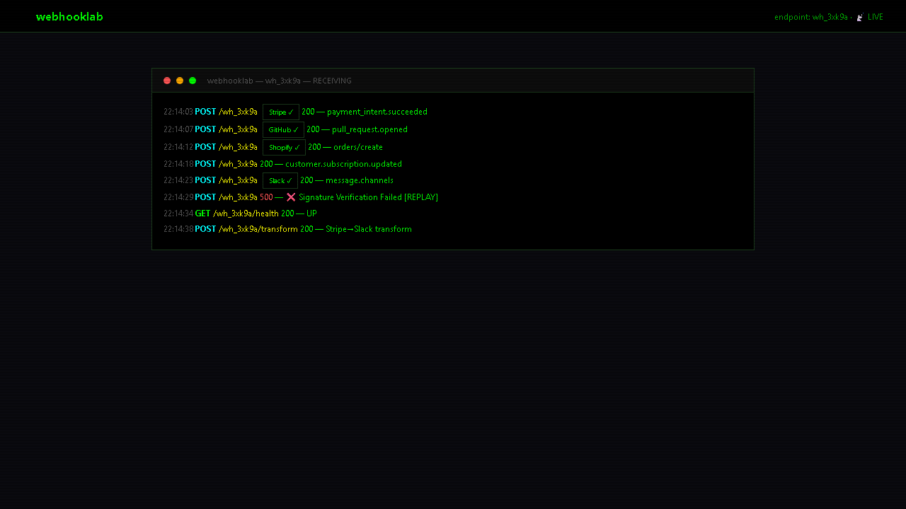

# WebhookLab — Webhook Inspection and Testing Gateway

[](LICENSE)
[](https://www.typescriptlang.org/)
[](https://nextjs.org/)

Persistent webhook endpoints for development and testing. Live WebSocket feed, provider auto-detection with signature verification, payload replay, and transform engine.

## Screenshots

| Landing Page | Webhook Live Feed |
|:---:|:---:|
|  |

## Features

- Persistent endpoint URLs — no expiration
- WebSocket live feed: incoming webhooks appear without refresh
- Auto-detects and verifies signatures for Stripe, GitHub, Shopify, and Slack
- Payload replay with editable fields for edge-case testing
- Transform engine: convert between formats (Stripe to Slack, GitHub to Discord, custom)
- Team sharing: invite teammates to a session, view webhooks in real time
- Retry and timeout simulation for testing downstream error handling

## Quick Start

```bash
git clone https://github.com/adlptv/webhooklab.git
cd webhooklab
pnpm install
pnpm dev
```

Or:
```bash
docker-compose up
```

## Architecture

```
apps/webhooklab/
├── src/app/          # Pages: landing, dashboard, endpoint detail, settings
│   └── api/          # endpoints, webhooks/[id], health
├── src/components/   # WebhookFeed, Inspector, ReplayPanel, TransformEngine, UI primitives
├── src/lib/          # Signature verification (Stripe, GitHub, Shopify, Slack), validators (Zod)
├── prisma/           # SQLite: Endpoint, WebhookRequest, Transform
└── tests/
```

## Supported Providers

| Provider | Signature Header | Verification |
|----------|-----------------|--------------|
| Stripe | Stripe-Signature | Yes |
| GitHub | X-Hub-Signature-256 | Yes |
| Shopify | X-Shopify-Hmac-SHA256 | Yes |
| Slack | X-Slack-Signature | Yes |

## API

| Method | Endpoint | Purpose |
|--------|----------|---------|
| GET/POST | /api/endpoints | List or create endpoints |
| GET/DELETE | /api/endpoints/[id] | Get or delete an endpoint |
| GET | /api/endpoints/[id]/requests | List incoming requests |
| GET | /api/endpoints/[id]/requests/[reqId] | Request detail with headers and body |
| POST | /api/endpoints/[id]/requests/[reqId]/replay | Replay a request |
| POST | /api/endpoints/[id]/requests/[reqId]/transform | Transform payload between formats |
| * | /api/webhooks/[id] | Catch-all webhook receiver |
| GET | /api/health | Health check |

## Security

- Zod validation on all routes
- Signature verification for all supported providers
- Rate limiting
- Helmet.js headers
- No secret values logged

## License

MIT